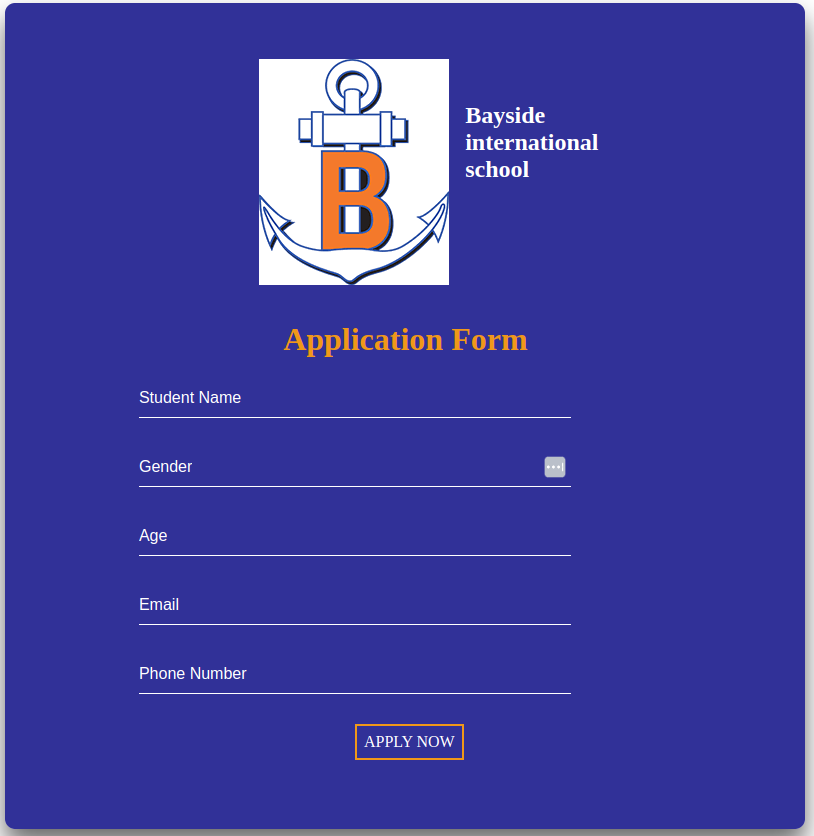

# BaySide international Highschool (Group 3)
## Table of Contents

**Here is the live link** https://phase2-project-git-main-ivys-projects-5c328d9e.vercel.app/

- [Introduction](#introduction)
- [Features](#features)
- [Technology](#technology)
- [Contributing](#contributing)
- [License](#license)

## Introduction

Through this project, we aim to provide a platform for our community to learn about the accomplishments and impact of BaySide International High School. It serves as a testament to the dedication and hard work of our students, faculty, and staff, and serves as a source of inspiration for students, alumni, and the wider community.

The project will feature a variety of content, including student testimonials, faculty spotlights, alumni success stories, and highlights of our academic and extracurricular programs. It will also provide information about our admissions process, scholarships, and other opportunities for students to explore.

## Features

Our project boasts a range of exciting features that make it an engaging and informative platform for our community. Some of the key features include:

### Alumni Success Stories

Read about the accomplishments of our alumni in their chosen fields
Learn about the ways in which their experiences at BaySide International High School prepared them for success
Get inspired by their stories of perseverance and achievement

### Academic and Extracurricular Programs

Learn about our rigorous academic programs and courses
Discover the range of extracurricular activities and clubs available to our students
Get a sense of the ways in which our programs and activities support student growth and development

### Admissions Process

Learn about the steps involved in applying to BaySide International High School
Get information about our admissions requirements and deadlines

## Technology
To run a React application, you'll need:

### Hardware Requirements:

- Modern multi-core CPU
- At least 4 GB of RAM (8 GB recommended)
- SSD with at least 10 GB of free space

### Software Requirements

#### 1. Operating System:

- Windows 10 or later
- macOS Mojave or later
- Modern Linux distribution (e.g., Ubuntu 18.04+)
- Node.js:

#### 2. Recommended Development Tools:

- Visual Studio Code (highly recommended)
- Other options: Atom, Sublime Text, WebStorm

#### 3. Git
Ensure Git is installed and properly configured

#### 4. Browser

Latest version of Google Chrome, Firefox, Safari, or Edge

## Contributing

Contributions are welcome! If you have any suggestions or improvements, please create an issue or submit a pull request.

Steps to Contribute

1. Fork the repository.

2. Create a new branch (`git checkout -b feature-branch`).

3. Make your changes.

4. Commit your changes (`git commit -m 'Add new feature`).

5. Push to the branch (`git push origin feature-branch`).

6. Open a pull request.

## License

MIT License

Copyright (c) [2024] [Group 3]

Permission is hereby granted, free of charge, to any person obtaining a copy of this software and associated documentation files (the "Software"), to deal in the Software without restriction, including without limitation the rights to use, copy, modify, merge, publish, distribute, sublicense, and/or sell copies of the Software, and to permit persons to whom the Software is furnished to do so, subject to the following conditions:

The above copyright notice and this permission notice shall be included in all copies or substantial portions of the Software.

THE SOFTWARE IS PROVIDED "AS IS", WITHOUT WARRANTY OF ANY KIND, EXPRESS OR IMPLIED, INCLUDING BUT NOT LIMITED TO THE WARRANTIES OF MERCHANTABILITY, FITNESS FOR A PARTICULAR PURPOSE AND NONINFRINGEMENT. IN NO EVENT SHALL THE AUTHORS OR COPYRIGHT HOLDERS BE LIABLE FOR ANY CLAIM, DAMAGES OR OTHER LIABILITY, WHETHER IN AN ACTION OF CONTRACT, TORT OR OTHERWISE, ARISING FROM, OUT OF OR IN CONNECTION WITH THE SOFTWARE OR THE USE OR OTHER DEALINGS IN THE SOFTWARE.
